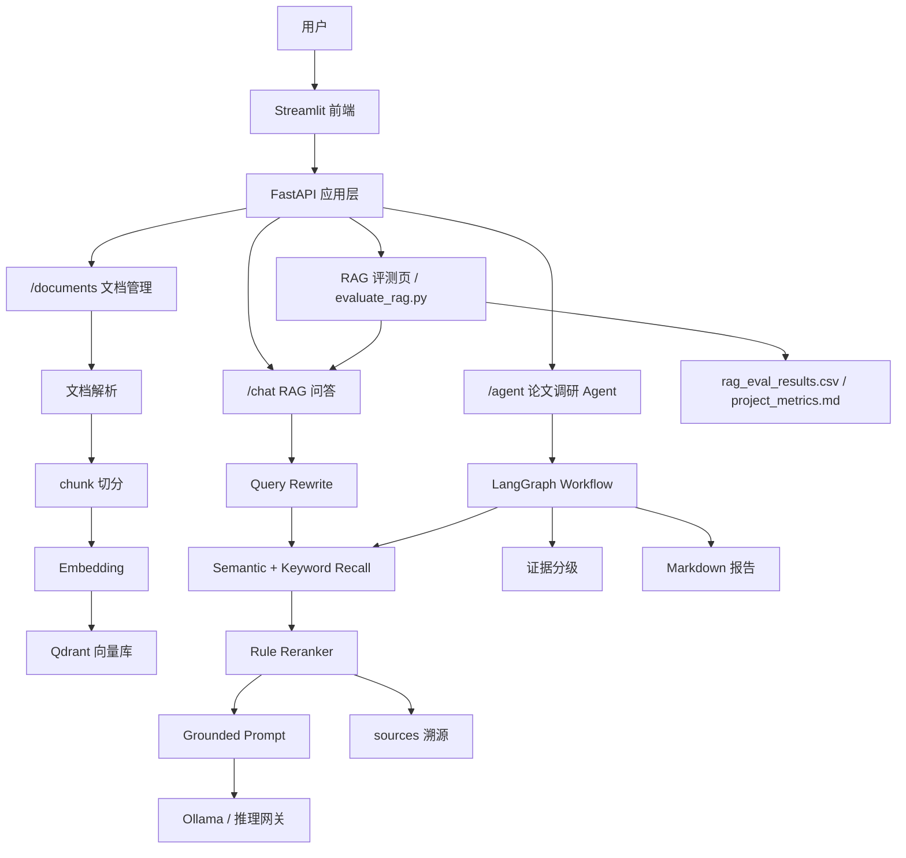
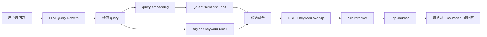
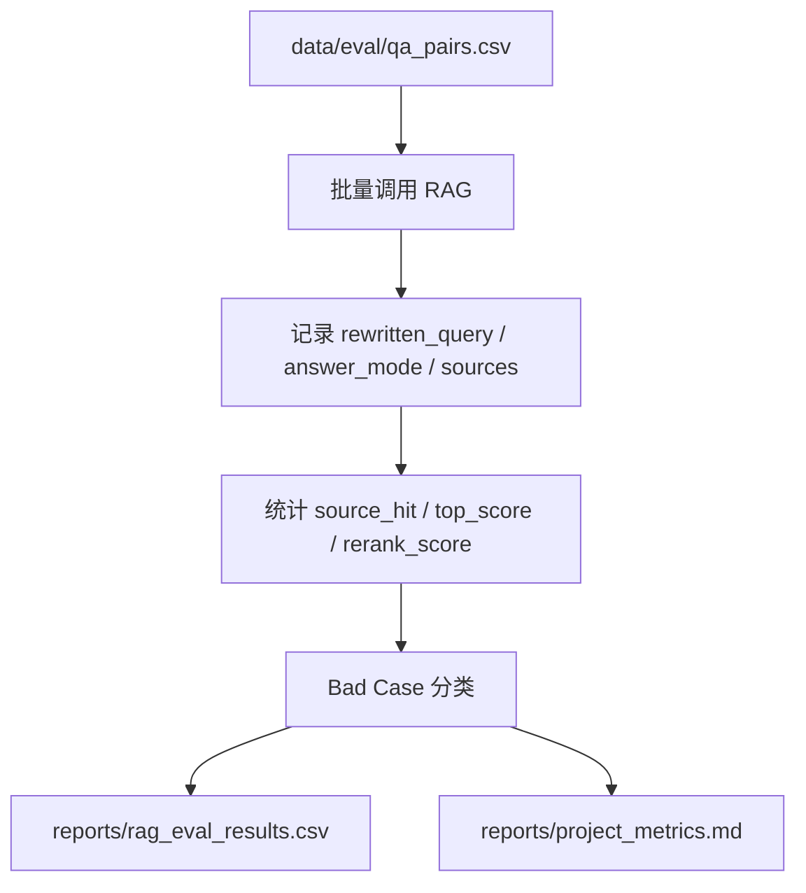

# LLM Paper RAG Assistant

面向大模型应用开发实习的本地私有化 Agentic RAG 工程项目。项目重点不是训练或微调大模型，而是把文档解析、向量入库、语义检索、Query Rewrite、Hybrid Search、Rerank、Prompt 组织、引用溯源、Agent 工作流、评测与 Bad Case 分析串成一条可运行、可解释、可复盘的工程链路。

## 1. 项目定位

| 模块 | 名称 | 主要能力 |
|---|---|---|
| 模块一 | 知识库 RAG 问答系统 | 文档上传、解析、chunk 切分、Embedding、Qdrant 检索、Query Rewrite、Hybrid Search、Rerank、sources 溯源 |
| 模块二 | Agentic 论文调研模块 | claim 拆分、证据分级、方法对比、overclaim check、tool_calls 日志、Markdown 报告导出 |
| 模块三 | RAG 评测与 Bad Case 分析 | QA 批量评测、rewritten_query、source_hit、answer_mode、Hybrid/Rerank 分数、bad_case_type |

适合展示给：大模型应用开发实习生、RAG 知识库实习生、AI Agent 实习生、Python AI 后端实习生。

## 2. 技术栈

| 分类 | 技术 |
|---|---|
| 后端 API | FastAPI, Pydantic, RESTful API |
| 前端展示 | Streamlit |
| RAG 链路 | LangChain TextSplitter, LangChain PromptTemplate, Embedding, TopK 检索 |
| Agent 编排 | LangGraph StateGraph |
| 向量数据库 | Qdrant |
| 本地模型 | Ollama, qwen2.5:7b, mxbai-embed-large |
| 文档解析 | PyMuPDF, python-docx, Markdown/TXT |
| 工程环境 | Docker Compose, Linux, Python venv |

## 3. 总体架构



## 4. Query Rewrite + Hybrid Search + Rerank 流程



说明：

- Query Rewrite 只用于检索，最终回答仍使用用户原问题。
- 当前 Rerank 是规则版，可插拔为后续 cross-encoder reranker，但本项目不夸大为已接入模型 reranker。
- sources 返回 `score / keyword_score / rerank_score / rrf_score / final_score / retrieval_source / semantic_rank / keyword_rank`，便于解释检索质量。

## 5. RAG 评测与 Bad Case 分析流程



Bad Case 类型包括：

- `fallback_triggered`：检索资料不足，进入模型补充回答。
- `strict_no_answer`：严格知识库模式下拒答。
- `no_sources`：没有可用 sources。
- `expected_source_missed`：没有命中期望来源文件。
- `low_top_score`：最高相似度偏低。

## 6. 快速启动

```powershell
cd C:\Users\Administrator\Desktop\code\llm-paper-rag-assistant
.\.venv\Scripts\Activate.ps1
docker compose up -d qdrant
uvicorn app.main:app --reload
```

Swagger：

```text
http://127.0.0.1:8000/docs
```

启动 Streamlit：

```powershell
streamlit run streamlit_app.py
```

前端页面：

```text
http://localhost:8501
```

需要的 Ollama 模型：

```powershell
ollama pull qwen2.5:7b
ollama pull mxbai-embed-large
```

## 7. API

| 接口 | 作用 |
|---|---|
| `GET /health` | 服务健康检查 |
| `GET /documents` | 查看知识库文件清单 |
| `POST /documents/upload` | 上传并入库文档 |
| `DELETE /documents/{file_name}` | 删除指定文件的向量索引 |
| `POST /documents/{file_name}/reindex` | 基于已上传原文件重建索引 |
| `POST /chat` | 基于知识库问答，返回 `rewritten_query` 和 sources |
| `GET /chat/logs` | 查看最近 RAG 问答 run 日志 |
| `POST /agent/research` | 运行论文调研 Agent |
| `GET /agent/runs` | 查看历史 Agent run 简表 |
| `GET /agent/runs/{run_id}` | 查看某次 Agent 执行日志 |
| `GET /agent/runs/{run_id}/report` | 下载某次 Agent run 的 Markdown 报告 |

`POST /chat` 示例：

```json
{
  "question": "RAG 论文为什么认为仅依赖参数化记忆会有局限？",
  "top_k": 5,
  "allow_fallback": true,
  "answer_style": "standard"
}
```

响应会包含：

```json
{
  "run_id": "rag-...",
  "rewritten_query": "limitations of relying only on parametric memory in RAG paper",
  "answer_mode": "grounded",
  "answer": "...",
  "sources": []
}
```

## 8. 评测与证据

完整评测：

```powershell
.\.venv\Scripts\python.exe scripts\evaluate_rag.py
```

快速评测前 3 条：

```powershell
.\.venv\Scripts\python.exe scripts\evaluate_rag.py --limit 3
```

输出文件：

```text
reports/rag_eval_results.csv
reports/project_metrics.md
reports/rag_chat_runs.jsonl
```

当前本地完整评测结果：

```text
评测问题数：20
grounded：20
fallback：0
no_answer：0
命中期望来源：20
Bad Case：0
Top 来源类型：hybrid 18，semantic 2
```

评测结果会随当前知识库、检索配置和模型状态变化。建议在 Qdrant、Ollama、推理网关和 FastAPI 启动后重新运行完整 QA，并把生成的 CSV/Markdown 作为项目证据。

## 9. 展示材料

截图清单见：

```text
docs/screenshots/README.md
```

建议至少准备：

- Swagger 接口页。
- Streamlit RAG 问答页，显示 `rewritten_query` 和 sources。
- sources 展开页，显示 `score / rerank_score / final_score / retrieval_source`。
- RAG 评测页，显示 source_hit、answer_mode、Bad Case。
- Agent 报告页，显示 plan、tool_calls、evidence_items、final_report。
- 推理网关日志或 metrics 页面，证明上层 RAG 通过统一网关调用模型。

## 10. 面试可讲点

- 文档解析：PDF 按页保留来源，回答后可回到具体文件和页码核验。
- RAG 链路：文档解析、chunk 切分、Embedding、Qdrant 入库、Query Rewrite、Hybrid Search、Rerank、Prompt 生成和答案返回。
- 回答模式：区分知识库依据、模型通用知识补充、严格拒答和 metadata 查询。
- 引用溯源：sources 返回文件名、页码、chunk_id、score、rerank_score、final_score、retrieval_source 和 evidence_level。
- 评测闭环：通过 QA 批量评测记录 source_hit、answer_mode、Bad Case 类型，用于定位检索和回答问题。
- Agentic RAG：把普通问答升级为 claim 拆分、证据分级、方法对比和报告生成。
- 工程边界：当前是本地可运行工程实践，不是生产级平台，没有真实用户上线，也没有训练或微调大模型。

## 11. 当前局限与后续优化

- 当前 Rerank 是规则版，不是 cross-encoder reranker；复杂问题仍可能召回弱相关片段。
- Query Rewrite 依赖本地 LLM，偶尔可能改写偏题，评测时需要记录并分析。
- 文档管理已支持文件级删除和重建索引，后续可继续补版本管理和权限控制。
- Agent 是限定流程内的 LangGraph 工作流，不是完全自主规划型 Agent。
- 评测脚本和 Streamlit 评测页已能记录结果，后续可继续接入 RAGAS 或更完整的自动评分。

后续优先级：

| 优先级 | 优化项 | 价值 |
|---|---|---|
| P0 | 完整跑 QA 并整理 Bad Case | 给简历和面试补真实评测证据 |
| P1 | 接入 cross-encoder reranker | 强化检索质量优化能力 |
| P1 | 增加文档版本管理和权限控制 | 更接近企业知识库需求 |
| P2 | 增加 RAGAS 自动评分 | 补充 faithfulness / context precision 等指标 |

## 12. 推理网关联动说明

本项目支持通过 `llm-local-inference-gateway` 统一调用本地大模型服务。开启 `.env` 中的 `USE_INFERENCE_GATEWAY=true` 后，RAG/Agent 系统不再直接访问 Ollama，而是通过推理网关调用：

- Chat：`POST /v1/chat/completions`
- Embedding：`POST /v1/embeddings`

这样可以把上层 RAG/Agent 业务逻辑与底层模型服务解耦。后续如需替换为 vLLM、LiteLLM 或其他 OpenAI-compatible 服务，优先调整推理网关配置，不需要重写 RAG 主链路。
