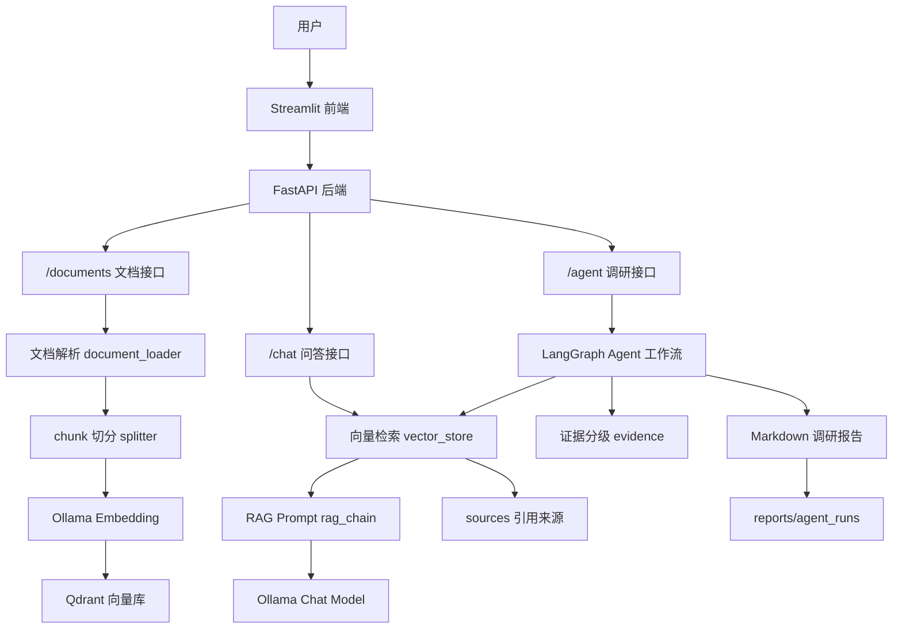
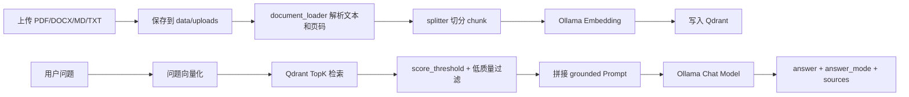
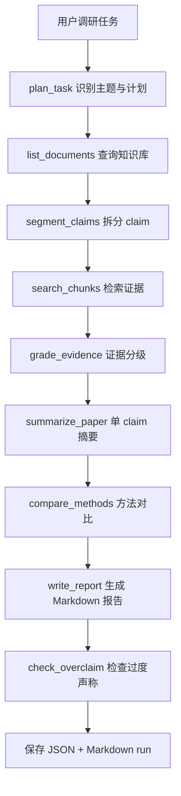
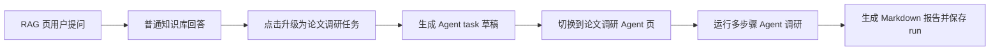

# LLM Paper RAG Assistant 两个项目完整说明

本文档用于向同学、导师、面试官或后续维护者解释当前工程里的两个项目：它们分别是什么、包含哪些代码、实现了哪些功能、如何运行、如何联动，以及面试时应该怎么讲。文档只总结当前已经实现的能力，不把项目夸大为生产级系统、企业上线项目或模型训练项目。

## 1. 项目整体定位

当前仓库名称为 `llm-paper-rag-assistant`，它不是单一小 demo，而是围绕“大模型应用开发 / RAG 知识库 / AI Agent 工程化”方向构建的一套本地可运行工程。仓库里包含两个互相呼应的项目：

| 项目 | 名称 | 主要定位 | 面试体现能力 |
|---|---|---|---|
| 项目一 | 论文知识库 RAG 问答系统 | 把论文、技术文档、笔记入库，支持基于知识库的可溯源问答 | RAG 工程化、文档解析、向量检索、Prompt、防幻觉、API 封装 |
| 项目二 | Agentic 论文调研助手 | 在 RAG 底座上增加 Agent 编排，完成多步骤论文调研和报告生成 | LangGraph、工具调用、执行日志、证据分级、报告持久化、可观测性 |

两个项目不是完全割裂的。项目一是底座，负责文档入库、Embedding、Qdrant 检索、Ollama 调用、sources 溯源；项目二复用这些底层能力，把它们封装成 Agent 工具链，实现“复杂问题调研、证据分级、方法对比、Markdown 报告生成”。

适合投递的岗位方向包括：

- 大模型应用开发实习生
- RAG 知识库实习生
- AI Agent 实习生
- AI 工程化实习生
- Python AI 应用开发实习生

核心技术关键词：`Python`、`FastAPI`、`Streamlit`、`Qdrant`、`Ollama`、`LangChain`、`LangGraph`、`RAG`、`Embedding`、`PromptTemplate`、`Docker Compose`、`文档解析`、`引用溯源`、`Agent Tool Workflow`。

## 2. 总体技术架构

系统整体由五层组成：前端页面、后端 API、RAG 服务层、Agent 编排层、数据与报告层。



主要组件说明：

| 组件 | 技术 | 作用 |
|---|---|---|
| 后端 API | FastAPI | 提供文档上传、问答、Agent 调研、历史 run 查询等 RESTful 接口 |
| 前端页面 | Streamlit | 提供文档上传、知识库问答、Agent 调研、报告下载等交互页面 |
| 向量数据库 | Qdrant | 存储 chunk 向量和 payload，支持 TopK 相似度检索 |
| 本地模型服务 | Ollama | 调用本地 embedding 模型和 chat 模型 |
| RAG 编排 | LangChain PromptTemplate | 管理 grounded/fallback Prompt 模板 |
| Agent 编排 | LangGraph StateGraph | 串联任务规划、claim 拆分、检索、证据分级、报告生成等节点 |
| 容器服务 | Docker Compose | 启动 Qdrant，预留 API 容器化运行方式 |

配置文件作用：

| 文件 | 作用 |
|---|---|
| `.env.example` | 项目环境变量模板，配置 Ollama、Qdrant、chunk 参数、检索阈值等 |
| `requirements.txt` | Python 依赖清单，包括 FastAPI、LangChain、LangGraph、Qdrant、Streamlit 等 |
| `docker-compose.yml` | 定义 Qdrant 服务和 API 服务，其中 Qdrant 数据挂载到 `data/qdrant` |
| `Dockerfile` | API 服务容器化构建文件 |

当前默认模型配置：

```text
OLLAMA_CHAT_MODEL=qwen2.5:7b
OLLAMA_EMBEDDING_MODEL=mxbai-embed-large
QDRANT_COLLECTION=llm_papers
CHUNK_SIZE=800
CHUNK_OVERLAP=120
TOP_K=5
SCORE_THRESHOLD=0.3
```

## 3. 文件结构说明

下面是项目核心文件结构，已排除 `.venv`、`__pycache__` 和 Qdrant 底层 segment/WAL 文件。

```text
llm-paper-rag-assistant/
├── README.md
├── requirements.txt
├── Dockerfile
├── docker-compose.yml
├── streamlit_app.py
├── app/
│   ├── main.py
│   ├── config.py
│   ├── schemas.py
│   ├── routers/
│   │   ├── health.py
│   │   ├── documents.py
│   │   ├── chat.py
│   │   └── agent.py
│   ├── services/
│   │   ├── document_loader.py
│   │   ├── splitter.py
│   │   ├── llm_client.py
│   │   ├── vector_store.py
│   │   ├── rag_chain.py
│   │   ├── evidence.py
│   │   └── agent_run_store.py
│   └── agent/
│       └── research_agent.py
├── data/
│   ├── samples/
│   ├── uploads/
│   ├── eval/
│   │   └── qa_pairs.csv
│   └── qdrant/
├── reports/
│   ├── rag_eval_results.csv
│   ├── agent_runs/
│   │   ├── {run_id}.json
│   │   └── {run_id}.md
│   ├── resume_rag_agent_intern.md
│   └── interview_pack_rag_agent.md
└── scripts/
    └── evaluate_rag.py
```

核心文件职责：

| 文件 | 职责 |
|---|---|
| `app/main.py` | 创建 FastAPI 应用并注册 `health`、`documents`、`chat`、`agent` 路由 |
| `app/config.py` | 读取配置，设置项目根目录、Ollama/Qdrant 地址、chunk 参数、检索阈值，并处理本地代理绕过 |
| `app/schemas.py` | 定义 API 请求和响应结构，如 `ChatRequest`、`ChatResponse`、`ResearchResponse`、`SourceChunk` |
| `app/routers/documents.py` | 实现文档上传、文件名清洗、文档解析、切分、向量入库、知识库文件清单 |
| `app/routers/chat.py` | 实现普通 RAG 问答、metadata 问题识别、严格知识库模式、补充回答模式、sources 返回 |
| `app/routers/agent.py` | 实现 Agent 调研接口、历史 run 查询、Markdown 报告下载 |
| `app/services/document_loader.py` | 解析 PDF、DOCX、Markdown、TXT，并保留文件名和页码 |
| `app/services/splitter.py` | 使用 LangChain `RecursiveCharacterTextSplitter` 做 chunk 切分，生成稳定 chunk_id |
| `app/services/llm_client.py` | 封装 Ollama embedding 和 chat 调用，使用 `trust_env=False` 避免本地请求误走代理 |
| `app/services/vector_store.py` | 封装 Qdrant collection 创建、向量写入、TopK 检索、文件清单聚合、低质量片段过滤 |
| `app/services/rag_chain.py` | 使用 LangChain `PromptTemplate` 管理 grounded/fallback Prompt 和回答模式判别 |
| `app/services/evidence.py` | 实现 claim 拆分、sources 证据分级、证据地图格式化、overclaim 检查 |
| `app/services/agent_run_store.py` | 保存和读取 Agent run，输出 JSON 执行日志和 Markdown 调研报告 |
| `app/agent/research_agent.py` | 使用 LangGraph 编排 Agentic RAG 工作流 |
| `streamlit_app.py` | Streamlit 前端，包含 RAG 问答页、论文调研 Agent 页、历史记录和报告下载 |
| `scripts/evaluate_rag.py` | 批量读取 `qa_pairs.csv`，调用 RAG 链路并输出评测结果 CSV |

## 4. 模块一：论文知识库 RAG 问答系统

### 4.1 项目目标

项目一的目标是构建一个面向论文和技术文档的知识库问答系统。用户可以上传论文 PDF、Word 文档、Markdown 或 TXT 文本，系统会将文档解析、切分、向量化并写入 Qdrant。之后用户可以提问，系统从知识库中检索相关片段，拼接 Prompt 调用本地大模型，并返回带引用来源的回答。

这个项目重点不是训练大模型，而是展示大模型应用开发中常见的工程链路：文档解析、Embedding、向量库、RAG Prompt、API 封装、前端展示、引用溯源和检索质量控制。

### 4.2 核心功能

| 功能 | 实现说明 |
|---|---|
| 文档上传 | `POST /documents/upload` 接收文件，支持 PDF、DOCX、Markdown、TXT |
| 文件名安全处理 | `_safe_file_name` 去除路径和特殊字符，避免覆盖非预期文件 |
| 文档解析 | PDF 用 PyMuPDF 按页解析，DOCX 用 python-docx 读取段落，文本类文件按 UTF-8 读取 |
| chunk 切分 | 使用 LangChain `RecursiveCharacterTextSplitter`，默认 `chunk_size=800`、`chunk_overlap=120` |
| Embedding | 调用 Ollama `/api/embed`，旧版本自动回退 `/api/embeddings` |
| 向量入库 | Qdrant collection 使用 cosine 距离，payload 保存 `chunk_id/file_name/page/content` |
| 语义检索 | 用户问题转 embedding 后在 Qdrant TopK 检索，并按 `score_threshold` 过滤低分结果 |
| 低质量片段过滤 | 根据控制字符比例、异常符号比例过滤 PDF 解析质量差的片段 |
| RAG 回答 | grounded Prompt 要求模型只依据检索资料回答，资料不足时说明依据不足 |
| 补充回答 | 知识库不足时可调用本地模型通用知识补充，但不返回 sources |
| metadata 查询 | “知识库有哪些论文”等问题不走向量检索，直接聚合 Qdrant payload 返回文件清单 |
| 回答详细程度 | `brief`、`standard`、`detailed` 三档回答风格 |
| sources 溯源 | grounded 回答返回文件名、页码、chunk_id、score、证据等级和理由 |

### 4.3 数据流



### 4.4 核心接口

| 接口 | 入参 | 返回 | 作用 |
|---|---|---|---|
| `GET /health` | 无 | 服务状态 | 判断 FastAPI 是否启动 |
| `GET /documents` | 无 | 文档列表 | 查看当前知识库已入库文件、chunk 数、页码 |
| `POST /documents/upload` | 上传文件 | `file_name/chunks/status` | 文档解析、切分、向量化、写入 Qdrant |
| `POST /chat` | `question/top_k/allow_fallback/answer_style` | `answer/answer_mode/sources` | 基于知识库问答 |

`POST /chat` 请求示例：

```json
{
  "question": "RAG-Sequence 和 RAG-Token 的区别是什么？",
  "top_k": 5,
  "allow_fallback": true,
  "answer_style": "standard"
}
```

`answer_mode` 含义：

| 模式 | 含义 |
|---|---|
| `grounded` | 回答主要基于知识库检索到的 sources |
| `fallback` | 知识库依据不足，使用本地模型通用知识补充，不返回 sources |
| `no_answer` | 用户关闭补充回答或显式要求只依据知识库，资料不足时拒答 |
| `metadata` | 回答来自知识库文件清单等系统元信息，不走普通语义检索 |

### 4.5 核心代码链路

文档入库链路：

```text
app/routers/documents.py
  -> app/services/document_loader.py
  -> app/services/splitter.py
  -> app/services/llm_client.py
  -> app/services/vector_store.py
  -> Qdrant
```

问答链路：

```text
app/routers/chat.py
  -> app/services/vector_store.py
  -> app/services/evidence.py
  -> app/services/rag_chain.py
  -> app/services/llm_client.py
  -> Ollama
```

### 4.6 关键设计点

- PDF 按页解析，而不是整篇拼接，是为了让回答能返回具体页码，方便人工核验。
- chunk_id 基于文件名、页码、序号和内容生成，重复上传相同文档时能稳定覆盖同一批 point。
- Qdrant point id 使用 UUIDv5 从 chunk_id 派生，保证稳定且唯一。
- payload 保存 `chunk_id/file_name/page/content`，向量负责检索，payload 负责引用溯源。
- `score_threshold=0.3` 是第一版检索质量闸门，低于阈值的片段不进入 Prompt。
- fallback 和 grounded 分离，避免把模型通用知识误标为知识库来源。
- metadata 问题单独处理，避免用户问“知识库有哪些文件”时模型凭空猜测。
- httpx 请求设置 `trust_env=False`，避免本地 Ollama/Qdrant 请求被系统代理转发导致连接失败。

## 5. 模块二：基于 RAG 底座的 Agentic 论文调研模块

### 5.1 项目目标

模块二是在模块一 RAG 底座上增加 Agent 编排能力。它不是重新做一个知识库，而是把模块一已有的文档清单、向量检索、sources、证据分级和本地模型调用封装成工具链，用 LangGraph 串成多步骤工作流。

用户输入一个复杂调研任务，例如“对比 Self-RAG、CRAG、GraphRAG 的核心思想、优缺点和适用场景”，系统会自动拆分 claim，检索相关论文片段，对证据强弱进行判断，再生成 Markdown 调研报告，并保存完整执行日志。

### 5.2 核心功能

| 功能 | 实现说明 |
|---|---|
| 任务规划 | 根据用户调研任务提取主题，如 Self-RAG、CRAG、GraphRAG、ReAct、RAG |
| 文件清单查询 | 调用 `list_indexed_documents` 查看当前知识库有哪些文档 |
| claim 拆分 | 将宽泛任务拆成 3-6 个可检索、可验证的问题 |
| 主题检索 | 为每个 claim 生成英文检索 query，调用 Qdrant 检索相关 chunk |
| 证据分级 | 根据 score、关键词覆盖和 source 数量判断 strong/partial/background/weak/insufficient |
| 单篇摘要 | 对每个 claim 的检索片段调用本地模型生成摘要 |
| 方法对比 | 汇总多个摘要，生成 Markdown 方法对比表 |
| 报告生成 | 按“调研目标、技术缺口、方法路线、证据地图、方法对比、工程启发、局限”组织报告 |
| 过度声称检查 | 检查报告中是否把证据不足内容写成确定性强结论 |
| 工具调用日志 | 记录 tool_name、input、output、duration_ms、status、source_count |
| run 持久化 | 每次 Agent 运行生成 JSON 和 Markdown 文件，支持重启后读取 |
| 报告下载 | 通过 API 和 Streamlit 下载 Markdown 报告 |

### 5.3 Agent 工作流



当前 LangGraph 节点顺序：

```text
plan_task
-> list_documents
-> segment_claims
-> search_chunks
-> grade_evidence
-> summarize_paper
-> compare_methods
-> write_report
-> check_overclaim
-> END
```

### 5.4 核心接口

| 接口 | 入参 | 返回 | 作用 |
|---|---|---|---|
| `POST /agent/research` | `task/top_k` | 调研报告、证据地图、tool_calls、sources | 运行论文调研 Agent |
| `GET /agent/runs` | 无 | run 简表 | 查看最近 Agent 运行历史 |
| `GET /agent/runs/{run_id}` | run_id | 完整 run JSON | 查看某次执行日志和结果 |
| `GET /agent/runs/{run_id}/report` | run_id | Markdown 文本 | 下载某次 Agent 报告 |

`POST /agent/research` 请求示例：

```json
{
  "task": "对比 Self-RAG、CRAG、GraphRAG 的核心思想、优缺点和适用场景，并生成一份调研报告。",
  "top_k": 5
}
```

返回内容包括：

| 字段 | 含义 |
|---|---|
| `run_id` | 本次 Agent run 的唯一 ID |
| `plan` | Agent 执行计划 |
| `tool_calls` | 每一步工具调用日志 |
| `evidence_items` | 每个 claim 的证据等级、来源文件、页码、top_score |
| `overclaim_warnings` | 报告中的过度声称风险提示 |
| `final_report` | 最终 Markdown 调研报告 |
| `sources` | 报告引用的 source chunks |
| `created_at` | 运行时间 |
| `report_path` | Markdown 报告本地路径 |

### 5.5 核心代码链路

```text
app/routers/agent.py
  -> app/agent/research_agent.py
  -> app/services/evidence.py
  -> app/services/vector_store.py
  -> app/services/llm_client.py
  -> app/services/agent_run_store.py
```

### 5.6 关键设计点

- Agent 是限定流程内的 Agentic RAG，不是完全自主 Agent，优点是可控、可调试、适合面试讲清楚。
- `ResearchState` 保存整个工作流状态，包括 task、topics、claims、chunks、summaries、comparison、report、sources、tool_calls。
- `split_claims` 借鉴科研引用审查思路：先拆成可验证 claim，再检索证据。
- `grade_claim_evidence` 不只看有没有搜到片段，还判断 evidence_level 和 evidence_reason。
- `check_overclaim` 会检查“完全、必然、显著提升、生产级”等强表述，防止报告写得超过证据支持范围。
- `agent_run_store.py` 同时保存 JSON 和 Markdown：JSON 方便机器复盘，Markdown 方便人打开查看和面试展示。
- API 内存中保存 run，同时支持从 `reports/agent_runs/{run_id}.json` 回读，避免服务重启后历史记录丢失。

## 6. 前端页面说明

前端入口是 `streamlit_app.py`，它是一个轻量 Streamlit 页面，不承担复杂业务逻辑。真正的文档解析、RAG 检索、Prompt 组装、Agent 调研都由 FastAPI 后端完成。

页面主要包含两个 Tab：

| 页面 | 作用 |
|---|---|
| `RAG 问答` | 上传文档后进行普通知识库问答，展示回答模式和引用来源 |
| `论文调研 Agent` | 输入复杂调研任务，运行 LangGraph Agent，展示计划、工具调用、证据地图、最终报告和 sources |

侧边栏功能：

- 检查 FastAPI 后端是否可连接。
- 上传 PDF / DOCX / Markdown / TXT。
- 设置检索 TopK。
- 设置是否允许本地模型补充回答。
- 设置回答详细程度：标准、简洁、详细。
- 展示当前知识库文件清单。

项目联动功能：



这个联动是两个项目的亮点：简单问题走普通 RAG，复杂问题升级为 Agent 调研，形成“问答 -> 调研 -> 报告”的闭环。

## 7. 数据与报告目录

| 路径 | 内容 |
|---|---|
| `data/samples` | 推荐公开论文样例，如 RAG、Self-RAG、CRAG、GraphRAG、ReAct |
| `data/uploads` | 用户上传并入库的文档 |
| `data/eval/qa_pairs.csv` | RAG 评测问题集 |
| `data/qdrant` | Qdrant 本地持久化数据，不建议人工修改 |
| `reports/rag_eval_results.csv` | RAG 评测脚本输出结果 |
| `reports/agent_runs/{run_id}.json` | Agent run 完整机器可读日志 |
| `reports/agent_runs/{run_id}.md` | Agent run Markdown 调研报告 |
| `reports/resume_rag_agent_intern.md` | 简历草稿 |
| `reports/interview_pack_rag_agent.md` | 面试准备材料 |

当前样例论文包括：

| 文件 | 方向 |
|---|---|
| `01_rag_knowledge_intensive_nlp.pdf` | RAG 基础论文 |
| `02_self_rag.pdf` | Self-RAG / 自反思检索增强 |
| `03_corrective_rag.pdf` | CRAG / 检索纠错 |
| `04_graphrag_local_to_global.pdf` | GraphRAG / 图增强总结 |
| `05_react_reasoning_acting.pdf` | ReAct / Agent reasoning + acting |

## 8. 如何运行和验证

进入项目目录：

```powershell
cd C:\Users\Administrator\Desktop\code\llm-paper-rag-assistant
```

激活虚拟环境：

```powershell
.\.venv\Scripts\Activate.ps1
```

启动 Qdrant：

```powershell
docker compose up -d qdrant
```

启动 FastAPI：

```powershell
uvicorn app.main:app --reload
```

打开 Swagger：

```text
http://127.0.0.1:8000/docs
```

启动 Streamlit 前端：

```powershell
streamlit run streamlit_app.py
```

打开前端：

```text
http://localhost:8501
```

如果本地没有 Ollama 模型：

```powershell
ollama pull qwen2.5:7b
ollama pull mxbai-embed-large
```

推荐验证问题：

| 问题 | 预期展示能力 |
|---|---|
| `你的知识库包含哪些论文？` | metadata 模式，返回文件清单 |
| `RAG-Sequence 和 RAG-Token 的区别是什么？` | grounded 模式，返回 sources |
| `FastAPI 是什么？` | 知识库不足时展示本地模型补充回答 |
| `请只根据知识库回答：FastAPI 是什么？` | 严格知识库模式，资料不足时不使用通用知识补充 |
| `对比 Self-RAG、CRAG、GraphRAG 的核心思想、优缺点和适用场景` | Agentic 论文调研、证据分级、报告生成 |

运行评测脚本：

```powershell
.\.venv\Scripts\python.exe scripts\evaluate_rag.py --limit 3
```

评测结果输出：

```text
reports/rag_eval_results.csv
```

评测脚本会记录：问题、期望答案、答案、answer_mode、source_count、source_files、source_hit、top_score。它不自动判断答案完全正确，而是用于复盘检索效果和准备面试材料。

## 9. 面试讲法

### 9.1 项目一怎么讲

可以这样概括：

> 我做了一个基于 FastAPI + Qdrant + Ollama 的论文知识库 RAG 问答系统。它支持上传 PDF、Word、Markdown、TXT，后端会解析文档、按页保留来源、用 LangChain TextSplitter 切 chunk、调用 Ollama 生成 embedding，并把向量和 payload 写入 Qdrant。用户提问时，系统先检索 TopK 相关片段，再拼接 grounded Prompt 调用本地大模型，最后返回答案和 sources，包括文件名、页码、chunk_id、score 和证据等级。

重点讲的能力：

- 文档解析：为什么 PDF 要保留页码。
- chunk 策略：chunk_size 和 overlap 如何影响召回。
- 向量库设计：Qdrant 存向量，payload 存引用信息。
- 防幻觉：资料不足时不强答，严格知识库模式和补充回答模式分开。
- sources 溯源：回答可以追溯到具体文件和页码。
- 工程化：FastAPI 提供 RESTful API，Streamlit 只做轻量交互。

面试官可能追问：

- 为什么用 Qdrant 而不是 FAISS？
- chunk_size 和 overlap 怎么调？
- score_threshold 设置多少合适？
- 为什么补充回答不能返回 sources？
- 如果文档重复上传、旧文档更新，系统如何处理？
- 如果要做企业级权限控制，你会怎么改？

### 9.2 项目二怎么讲

可以这样概括：

> 在第一个 RAG 系统基础上，我又做了一个基于 LangGraph 的 Agentic 论文调研助手。它不是重新建知识库，而是复用已有的 Qdrant 检索、Ollama 调用和 sources 溯源能力，在上层增加任务规划、claim 拆分、证据分级、论文摘要、方法对比、报告生成和过度声称检查。每次 Agent 运行都会保存 tool_calls、evidence_items、sources 和 Markdown 报告，便于复盘和面试展示。

重点讲的能力：

- LangGraph：用 StateGraph 串联多步骤工作流。
- Agent 工具链：把文档列表、检索、摘要、对比、报告生成拆成可观测步骤。
- claim 拆分：复杂问题先拆成可验证子问题。
- evidence map：不是搜到片段就当作证明，而是判断证据强弱。
- overclaim check：避免报告写出超出证据支持范围的结论。
- run 持久化：JSON 给机器复盘，Markdown 给人阅读和下载。

面试官可能追问：

- 你的 Agent 和普通 RAG 有什么区别？
- 为什么用 LangGraph，而不是只用 LangChain？
- 这个 Agent 是完全自主的吗？如果不是，为什么这样设计？
- tool_calls 日志里记录了什么？
- evidence_level 怎么判断？
- Markdown 报告如何保证不乱写结论？

### 9.3 不能夸大的地方

简历和面试中不要说：

- 这是生产级系统。
- 已经上线服务真实用户。
- 提升准确率 xx%。
- 训练或微调了大模型。
- 实现了完整企业权限系统。
- 实现了完全自主 Agent 平台。

更稳妥的说法是：

- 本地可运行的大模型应用工程实践。
- 支持 RAG 问答、引用溯源和 Agentic 调研报告生成。
- 通过评测脚本和 run 日志增强结果可复盘性。
- 当前是面向实习求职展示的工程化项目，后续可继续补 Rerank、权限控制和在线评测。

## 10. 当前局限与后续优化

当前局限：

- 还没有接入 Rerank，复杂问题可能召回弱相关片段。
- 中文问题检索英文论文时可能存在跨语言召回噪声。
- 文档管理还比较基础，目前没有删除文档、重建索引、版本管理和权限控制。
- Agent 是限定流程内的 LangGraph 工作流，不是完全自主规划型 Agent。
- 评测脚本只记录答案和 sources，还没有自动评分或人工评分表。
- Streamlit 页面适合展示和学习，不是完整产品级前端。

后续优化方向：

| 优化方向 | 具体做法 | 对面试的价值 |
|---|---|---|
| Rerank | 在 Qdrant TopK 后增加 bge-reranker 或 LLM rerank | 体现检索质量优化能力 |
| Query Rewrite | 将中文问题改写为英文检索 query 或多路 query | 解决中文问英文论文的召回噪声 |
| 文档管理 | 增加删除文档、按文件重建索引、重复文档检测 | 更接近企业知识库系统 |
| 权限控制 | 增加用户、文档权限、知识库隔离 | 适合企业 RAG 场景 |
| 评测看板 | 统计 source_hit、answer_mode、top_score、人工评分 | 体现可评估、可迭代能力 |
| Agent 动态工具调用 | 让 Agent 根据状态选择是否继续检索、是否改写 query | 更接近真实 Agentic RAG |
| 报告导出增强 | 支持 PDF/Word 报告导出 | 更适合演示和交付 |

## 11. 一句话总结

这个仓库可以概括为：

> 一个面向大模型应用实习方向的 Agentic RAG 工程项目：项目一实现论文知识库的文档入库、向量检索、可溯源问答；项目二在 RAG 底座上增加 LangGraph Agent 编排，实现 claim 拆分、证据分级、方法对比、过度声称检查和 Markdown 调研报告导出。
